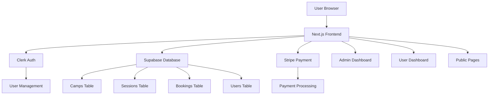
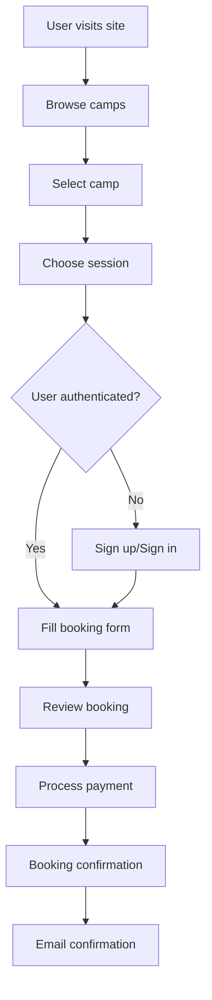

# SKILLWRAP Website Architecture Plan

## Project Overview
A Next.js website for SKILLWRAP tech summer camp company featuring camp registration, payment processing, and user management.

### Camps Offered
1. **Software Dev: AI-Powered Productivity**
2. **Full-Stack Dev: The Startup Prototype**
3. **Entrepreneurship: Little Shark Tank**
4. **Esports Academy**

Each camp runs 4 times over the summer (2 morning sessions, 2 afternoon sessions).

## Tech Stack
- **Frontend**: Next.js 14+ with TypeScript
- **Styling**: TailwindCSS
- **Database**: Supabase (PostgreSQL)
- **Authentication**: Clerk
- **Payments**: Stripe
- **Deployment**: Vercel

## System Architecture



## Database Schema

### Tables Structure

#### camps
```sql
id: uuid (primary key)
name: varchar(255)
slug: varchar(100) (unique)
description: text
short_description: varchar(500)
age_range: varchar(50)
max_capacity: integer
price: decimal(10,2)
image_url: varchar(500)
created_at: timestamp
updated_at: timestamp
```

#### sessions
```sql
id: uuid (primary key)
camp_id: uuid (foreign key -> camps.id)
session_number: integer (1-4)
time_slot: enum('morning', 'afternoon')
start_date: date
end_date: date
start_time: time
end_time: time
current_bookings: integer (default 0)
max_capacity: integer
status: enum('open', 'full', 'cancelled')
created_at: timestamp
updated_at: timestamp
```

#### bookings
```sql
id: uuid (primary key)
user_id: varchar(255) (Clerk user ID)
session_id: uuid (foreign key -> sessions.id)
student_name: varchar(255)
student_age: integer
parent_email: varchar(255)
parent_phone: varchar(20)
emergency_contact: varchar(255)
emergency_phone: varchar(20)
dietary_restrictions: text
special_needs: text
stripe_payment_intent_id: varchar(255)
payment_status: enum('pending', 'completed', 'failed', 'refunded')
booking_status: enum('confirmed', 'cancelled', 'waitlist')
total_amount: decimal(10,2)
created_at: timestamp
updated_at: timestamp
```

#### users (managed by Clerk, but we'll store additional info)
```sql
clerk_user_id: varchar(255) (primary key)
email: varchar(255)
first_name: varchar(255)
last_name: varchar(255)
phone: varchar(20)
role: enum('parent', 'admin')
created_at: timestamp
updated_at: timestamp
```

## Project Structure

```
skillwrap/
├── src/
│   ├── app/
│   │   ├── (auth)/
│   │   │   ├── sign-in/
│   │   │   └── sign-up/
│   │   ├── admin/
│   │   │   ├── camps/
│   │   │   ├── sessions/
│   │   │   ├── bookings/
│   │   │   └── dashboard/
│   │   ├── camps/
│   │   │   └── [slug]/
│   │   ├── dashboard/
│   │   ├── booking/
│   │   │   └── [sessionId]/
│   │   ├── api/
│   │   │   ├── camps/
│   │   │   ├── sessions/
│   │   │   ├── bookings/
│   │   │   ├── stripe/
│   │   │   └── webhooks/
│   │   ├── globals.css
│   │   ├── layout.tsx
│   │   └── page.tsx
│   ├── components/
│   │   ├── ui/
│   │   ├── forms/
│   │   ├── layout/
│   │   └── camp/
│   ├── lib/
│   │   ├── supabase.ts
│   │   ├── stripe.ts
│   │   ├── clerk.ts
│   │   └── utils.ts
│   ├── types/
│   │   └── index.ts
│   └── hooks/
├── public/
│   ├── images/
│   └── icons/
├── .env.local
├── next.config.js
├── tailwind.config.js
├── package.json
└── README.md
```

## Key Features & Pages

### Public Pages
1. **Landing Page** (`/`)
   - Hero section with SKILLWRAP branding
   - Camp overview cards
   - Testimonials
   - Call-to-action for registration

2. **Camps Listing** (`/camps`)
   - Grid of all 4 camps
   - Filter by age, time slot, availability
   - Quick booking buttons

3. **Individual Camp Pages** (`/camps/[slug]`)
   - Detailed camp description
   - Schedule and pricing
   - Available sessions with booking
   - Prerequisites and what to bring

### Authenticated Pages
4. **User Dashboard** (`/dashboard`)
   - Current bookings
   - Booking history
   - Profile management
   - Payment history

5. **Booking Flow** (`/booking/[sessionId]`)
   - Student information form
   - Emergency contact details
   - Payment processing
   - Confirmation page

### Admin Pages
6. **Admin Dashboard** (`/admin`)
   - Overview statistics
   - Recent bookings
   - Revenue tracking

7. **Camp Management** (`/admin/camps`)
   - Add/edit camp details
   - Manage pricing and capacity

8. **Session Management** (`/admin/sessions`)
   - Create session schedules
   - Monitor capacity and bookings

9. **Booking Management** (`/admin/bookings`)
   - View all bookings
   - Process refunds
   - Export data

## User Flow



## Integration Details

### Clerk Authentication
- Social logins (Google, Apple)
- Email/password authentication
- User profile management
- Role-based access control

### Supabase Setup
- Row Level Security (RLS) policies
- Real-time subscriptions for booking updates
- Database functions for capacity management
- Automated email triggers

### Stripe Integration
- Payment intents for secure processing
- Webhook handling for payment status
- Refund processing
- Invoice generation

## Security Considerations
- RLS policies for data access
- Input validation and sanitization
- CSRF protection
- Rate limiting on booking endpoints
- Secure webhook verification

## Performance Optimizations
- Next.js Image optimization
- Static generation for camp pages
- Database indexing on frequently queried fields
- Caching strategies for session availability
- Lazy loading for non-critical components

## Deployment Strategy
- Vercel for Next.js hosting
- Environment variable management
- Database migrations via Supabase CLI
- CI/CD pipeline with GitHub Actions
- Monitoring and error tracking

This architecture provides a scalable foundation for the SKILLWRAP website with room for future enhancements like waitlists, multi-week camps, and advanced reporting features.